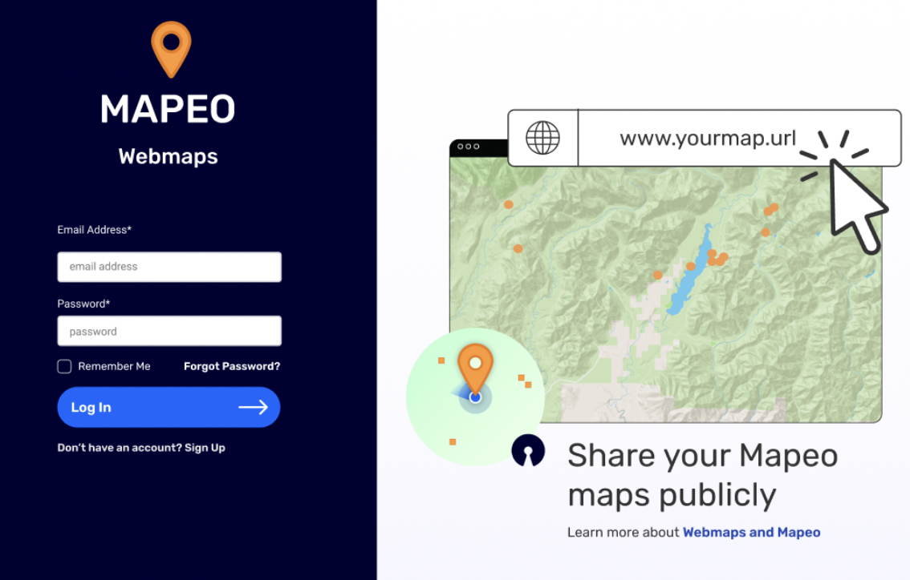

<h1 align="center">
  Mapeo Webmaps
</h1>



This is the repository for [Digital Democracy](digital-democracy.org/)'s [Mapeo Webmaps](https://maps.mapeo.app/) - a platform for Mapeo users to create and manage shares of maps via a public URL.


## Installation

You will need [Node v12 or later](https://nodejs.org/en/) installed.
1. Clone this repo and navigate into the folder you have cloned:

```sh
git clone https://github.com/digidem/mapeo-webmaps.git
cd mapeo-webmaps
```

2. Install dependencies with [npm](https://www.npmjs.com).

```sh
npm install
```

## Usage

1. Start the development server
```sh
npm run start:emulators
```
 >Note: You might be prompted to login to firebase. In this case, follow the instructions onscreen then re-run the command above.

2. To start the web app. In a new terminal window or tab, run:
```sh
npm start
```
This will open a browser window for the app. Note that the emulator command above will also serve the app on port 4000, but this is based on the static build in the `build` folder. The server on port 3000 is from `react-scripts` and will update based on code in `src`, and does not need to be built on every change.


## Useful links

### Core technologies and dependencies

- [TypeScript](https://www.typescriptlang.org/docs/handbook/intro.html) - a strongly typed programming language that builds on JavaScript
- [React](https://reactjs.org/docs/getting-started.html), scaffolded with [Create React App](https://create-react-app.dev/docs/getting-started)
- [Firebase](https://console.firebase.google.com/) as a backend and for authentication
- [Material UI](https://mui.com/material-ui/) - Ready-to-use foundational React components
- [Reach Router](https://reach.tech/router/) - a small, simple router for React.

### Related repositories and documentation

- [Mapeo Webmaps public](https://github.com/digidem/mapeo-webmaps-public) - Publicly shared webmaps from Mapeo (for which this project is the user admin side).
- [Mapeo](https://docs.mapeo.app) a free, easy-to-use, open source set of tools for collecting and mapping information.

## Contributing

Contributors are welcome! Check out the [Contributing guide](/CONTRIBUTING.md) for more info.

## License

<!-- MIT © -->